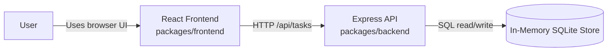
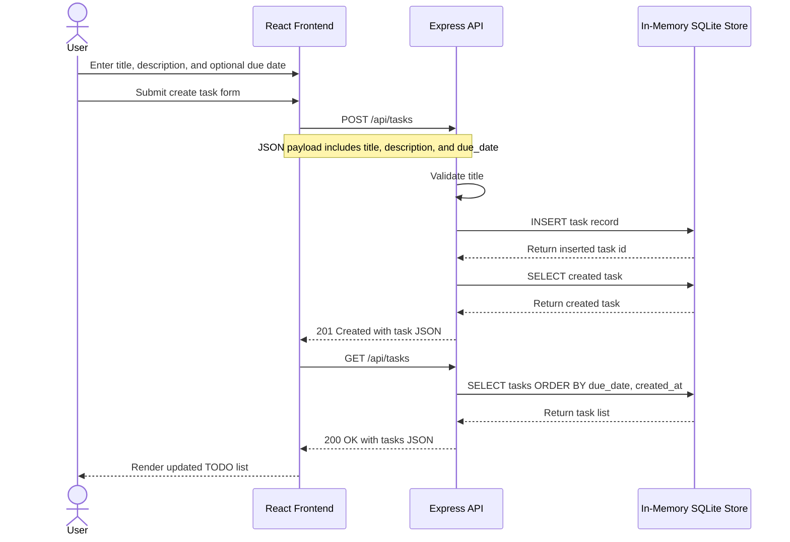

# Cloud Architecture Overview

This monorepo contains a React frontend, an Express API, and an in-memory SQLite data store. The diagrams below describe the system context and the request flow when a user creates a TODO item.

## System Context

## Sequence Diagram: Creating a TODO

